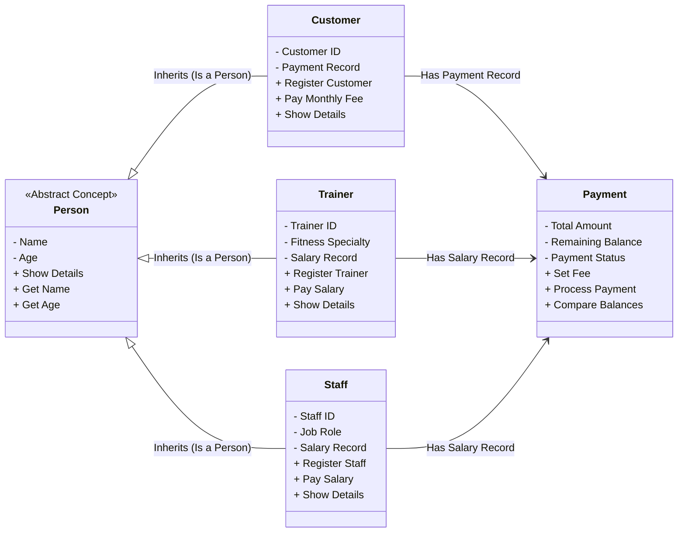

# Title Page

**Project Title:** FitCore — Gym Management System  
**Course:** Object-Oriented Programming (2nd Semester)  

**Submitted By:**  
1. Abdul Rehman (25-Arid-6105)  
2. Abdul Raqeeb (25-Arid-6103)  
3. Qasim Azeem (25-Arid-6161)  
4. Umer Ashiq (25-Arid-6195)  

**Submitted To:** [Muhammad Irfan]  

---
\pagebreak

# Table of Contents
1. [Introduction](#1-introduction)
2. [Problem Statement](#2-problem-statement)
3. [Project Objectives](#3-project-objectives)
4. [System Architecture and Deployment Strategy](#4-system-architecture-and-deployment-strategy)
5. [Detailed File Overview](#5-detailed-file-overview)
6. [System Design (Class Structure)](#6-system-design-class-structure)
7. [OOP Concepts Implementation in C++](#7-oop-concepts-implementation-in-c)
8. [File Handling Explanation](#8-file-handling-explanation)
9. [Templates Explanation](#9-templates-explanation)
10. [Screenshots of Output](#10-screenshots-of-output)
11. [Conclusion](#11-conclusion)

---
\pagebreak

# 1. Introduction
The **FitCore Gym Management System** is a comprehensive, full-stack software application built primarily to demonstrate the power and flexibility of Object-Oriented Programming (OOP) using C++. While most 2nd-semester academic projects are restricted to standard terminal interfaces using `cin` and `cout`, FitCore pushes the boundaries by integrating a robust C++ backend with a fully functional, modern web-based graphical user interface (GUI). 

This project operates as a REST API server written entirely in C++. Instead of taking inputs directly from a console, the C++ code continuously listens for HTTP requests transmitted from a web browser. Once data (such as a new customer registration or a salary payment) is received, the C++ engine processes it utilizing core OOP principles—such as polymorphism, inheritance, and encapsulation—before returning a dynamic response to the user interface. 

By designing the system in this manner, we aim to showcase that C++ is not merely an academic language for terminal scripts, but a high-performance engine capable of driving real-world, distributed web applications.

# 2. Problem Statement
Managing a modern fitness center involves juggling multiple, overlapping responsibilities. Gym administrators must continuously track customer memberships, ensure monthly fees are collected, manage trainer schedules, and disburse staff salaries accurately. Traditional gyms often rely on manual paper ledgers or disconnected, outdated software systems to handle these tasks. 

This manual approach introduces several critical vulnerabilities. Data entry errors are common, tracking pending financial dues is tedious, and paper records can be easily lost or damaged. Furthermore, when separate systems are used for customers and employees, generating a unified overview of the gym's operational status becomes incredibly difficult. 

There is an urgent requirement for an automated, centralized, and persistent system capable of handling multiple categories of personnel simultaneously while ensuring data integrity. The system must seamlessly connect a user-friendly frontend with a reliable, logic-driven backend to eliminate manual overhead.

# 3. Project Objectives
The FitCore project was developed with a dual focus: fulfilling academic requirements while creating a genuinely practical software solution. The specific objectives include:

*   **Practical Application of OOP:** To transition theoretical Object-Oriented concepts—including Abstraction, Encapsulation, Inheritance, Polymorphism, Operator Overloading, and Templates—into functional business logic within a C++ environment.
*   **Centralized Entity Management:** To build an extensible system capable of managing different types of entities (Customers, Trainers, and Staff) within a unified framework.
*   **Dynamic Financial Tracking:** To integrate a responsive payment tracking mechanism that automatically calculates total fees, remaining dues, and payment statuses for both revenue (customers) and expenses (staff/trainers).
*   **Reliable Data Persistence:** To guarantee that no information is lost when the server shuts down or restarts by implementing a custom file serialization system using C++ file streams.
*   **Modern Systems Integration:** To successfully bridge a frontend HTML/JS interface with a compiled C++ binary using modern web protocols, completely bypassing legacy console input methods.

# 4. System Architecture and Deployment Strategy
A significant achievement of this project is its flexible architecture, which allows it to run entirely locally on a laptop or be deployed globally to the cloud.

### Local Execution (Laptop CMD)
During the standard development lifecycle, the system is executed locally on a Windows machine. The backend is compiled using the MinGW GCC compiler. The process involves opening the Command Prompt (CMD), navigating to the backend directory, and running the `g++` compilation command. This generates a `server.exe` executable file. Once `server.exe` is launched in the CMD, it binds to port `8080` and begins listening for requests. The frontend interface (`index.html`) is then opened locally in any browser to interact with the C++ backend.

### Cloud Deployment and Version Control
To ensure the project is easily accessible and collaboratively managed, the entire codebase is hosted on GitHub.
*   **GitHub Repository:** `https://github.com/Akaza41/gym-management-cpp`

Furthermore, the C++ backend is not limited to a local Windows environment; it has been containerized and successfully deployed to the cloud. By utilizing a `Dockerfile`, the application is built in a Linux-based environment and hosted on Railway, a modern cloud platform. 
*   **Live Deployment URL:** `https://gym-management-cpp-production.up.railway.app/`

This cloud deployment proves the cross-platform capability of standard C++ code and allows anyone with the internet link to interact with the project without installing a compiler.

# 5. Detailed File Overview
The repository is carefully structured into separate directories and files to maintain a clean separation of concerns. This modularity is a key benefit of Object-Oriented design.

*   **`backend/main.cpp`**: The central execution point of the project. It sets up the HTTP server, defines the API routes (like `/register/customer` or `/view/staff`), handles data persistence (loading and saving files), and implements generic template functions.
*   **`backend/models/person.h`**: Contains the abstract base class `Person`. This file establishes the core blueprint for any human entity within the system, defining common traits like `name` and `age`, and enforcing the implementation of a `display()` function.
*   **`backend/models/customer.h`**: Defines the `Customer` class, which inherits from `Person`. It adds specific attributes such as a unique ID, customer counters, and a composition link to the `Payment` class for tracking gym fees.
*   **`backend/models/trainer.h`**: Defines the `Trainer` class, inheriting from `Person`. It includes trainer-specific attributes like fitness `specialty` (e.g., Yoga, Bodybuilding) and salary tracking.
*   **`backend/models/staff.h`**: Defines the `Staff` class, inheriting from `Person`. It tracks the employee's `role` (e.g., Manager, Receptionist) and manages their salary payouts.
*   **`backend/models/payment.h`**: A highly reusable utility class that handles all financial mathematics. It stores the total amount, remaining balance, and a status flag ("PAID" or "PENDING"). It also features operator overloading for easy comparisons.
*   **`include/httplib.h`**: A third-party, header-only HTTP library for C++. While we did not write this file, it is a crucial dependency that manages the complex TCP socket connections, allowing our C++ code to communicate with web browsers.
*   **`frontend/index.html`**: A single-page application built with HTML, CSS, and Vanilla JavaScript. It provides a beautiful, dark-themed user interface that sends AJAX requests to the C++ server.
*   **`Dockerfile`**: A configuration file used for cloud deployment. It contains instructions for pulling a Linux image, installing the GCC compiler, compiling the C++ code, and executing the server in a cloud environment.

# 6. System Design (Class Structure)
The system's architecture relies heavily on a hierarchical class structure. The `Person` class acts as the generalized root, while `Customer`, `Trainer`, and `Staff` act as specialized branches. Furthermore, the system utilizes "Composition" (a "Has-A" relationship) by integrating the `Payment` class into the derived classes.



# 7. OOP Concepts Implementation in C++

### 7.1 Classes and Objects
In FitCore, every tangible entity is modeled as a C++ Class. A class serves as a blueprint, grouping related data and the methods that manipulate that data. During runtime, the system instantiates these classes as Objects to represent real people.
```cpp
// Instantiating objects globally to store records
Customer customers[50]; 
Trainer trainers[20];   
Staff staffs[20];
```

### 7.2 Encapsulation (Data Hiding)
Encapsulation is strictly enforced to protect the integrity of the data. Attributes within classes like `Payment` and `Customer` are declared as `private` or `protected`. This prevents external functions from accidentally corrupting the data. Access is only granted through public getter and setter methods.
```cpp
class Payment {
private:
    float total;
    float remaining;
    char status[10];
public:
    void pay(float amount) {
        remaining -= amount;
        updateStatus(); // Internal logic hidden from outside
    }
    float getTotal() { return total; } // Safe read-only access
};
```

### 7.3 Inheritance
To eliminate redundant code, the system utilizes **Hierarchical Inheritance**. Since Customers, Trainers, and Staff all share common characteristics (they are all people with names and ages), these common attributes are placed in the `Person` base class. The derived classes then inherit these traits and add their specific features.
```cpp
// Customer inherits public and protected members from Person
class Customer : public Person {
private:
    int id;
    Payment payment; // Specific to Customer
    // name and age are implicitly available here
};
```

### 7.4 Polymorphism (Virtual Functions)
The system utilizes **Dynamic Polymorphism** (or Runtime Polymorphism) through the use of a pure virtual function. By declaring `virtual void display() = 0;` in the `Person` class, `Person` becomes an abstract class. This mandates that every single derived class must provide its own unique implementation of the `display()` function. When the system iterates through objects, it automatically knows which specific `display` function to call.
```cpp
// In base class Person.h
virtual void display() = 0; 

// Unique implementation in Customer.h
void display() override {
    cout << "| " << id << " | " << name << " | " << payment.getTotal() << " |\n";
}
```

### 7.5 Operator Overloading
Operator overloading allows standard C++ operators to be redefined to work with custom objects. In this project, the equality operator (`==`) is overloaded to easily compare two instances based on their unique IDs, which is extremely useful for searching. The greater-than operator (`>`) is overloaded in the `Payment` class to compare remaining balances.
```cpp
// In Customer.h
bool operator==(Customer& other) {
    return id == other.id; // Compares the internal IDs of two objects
}
```

### 7.6 Static Data Members & Functions
Static variables belong to the class itself, rather than to any individual object. FitCore uses static data members to maintain running totals of registered entities across the entire application lifecycle.
```cpp
// Inside Customer class declaration
static int totalCustomers;

// Initialized outside the class in global scope
int Customer::totalCustomers = 0;

// Static function to access the variable without an object instance
static int getTotalCustomers() {
    return totalCustomers;
}
```

# 8. File Handling Explanation
A major requirement for any enterprise system is data persistence—ensuring that information survives server reboots. FitCore implements a custom serialization engine using C++ standard file streams (`<fstream>`).

**Saving Data:** When an action occurs (e.g., a new user registers or pays a fee), the `saveAllData()` function is triggered. It uses the `ofstream` (Output File Stream) class to open local text files (`customers.txt`, `trainers.txt`, etc.). It first writes the total count of objects, followed by iterating through the arrays and writing each object's attributes line by line.

**Loading Data:** When the `server.exe` starts, the `loadAllData()` function is immediately called. It uses the `ifstream` (Input File Stream) class to read the text files. It dynamically reconstructs the objects by reading the strings and integers back into memory using `getline()` and passing the values to the `loadData()` methods of the respective classes.

```cpp
void saveAllData() {
    ofstream fc("customers.txt");
    if(fc.is_open()) {
        fc << c << "\n"; // Write total count of customers
        for(int i=0; i<c; i++) {
            // Serialize object attributes to file
            fc << customers[i].getId() << "\n"
               << customers[i].getName() << "\n"
               << customers[i].getAge() << "\n"; 
        }
        fc.close();
    }
}
```

# 9. Templates Explanation
C++ Templates are a powerful feature that enables generic programming. They allow developers to write a single algorithm that can process multiple different data types.

In FitCore, we needed a way to search through the array of Customers, the array of Trainers, and the array of Staff to find specific IDs. Without templates, we would have to write three nearly identical functions (`searchCustomer`, `searchTrainer`, `searchStaff`). By utilizing templates, we wrote a single `searchById<T>` function that dynamically adapts to whichever object array is passed to it, drastically reducing code duplication.

```cpp
// Generic Template Function
template <typename T>
int searchById(T arr[], int size, int id) {
    for(int i = 0; i < size; i++) {
        // Works as long as the object 'T' has a getId() method
        if(arr[i].getId() == id) { 
            return i; // Return the index if found
        }
    }
    return -1; // Return -1 if not found
}

// Example usage in the codebase:
// int index = searchById(customers, c, id);
```

# 10. Screenshots of Output

> **Note for the team:** Please run the project on your local machine, perform the following actions, take screenshots, and insert them below before finalizing the document.

1. **Screenshot 1: The C++ Server Console (Backend Execution)**  
   *(Take a screenshot showing the `server.exe` running in the Command Prompt (CMD) with the "GYM MANAGEMENT API RUNNING" initialization message).*  
   `[ INSERT SCREENSHOT HERE ]`

2. **Screenshot 2: Member Registration (Frontend UI)**  
   *(Take a screenshot of the web browser interface showing a completed registration form and the resulting success message).*  
   `[ INSERT SCREENSHOT HERE ]`

3. **Screenshot 3: Viewing Dynamic Records**  
   *(Take a screenshot of the 'Records' tab displaying the registered members in the data tables, showcasing both 'PENDING' and 'PAID' statuses).*  
   `[ INSERT SCREENSHOT HERE ]`

4. **Screenshot 4: Console Output during API Interaction**  
   *(Take a screenshot of the CMD terminal displaying the real-time C++ function calls (e.g., `Customer::setData()`) that occur when the browser sends a request).*  
   `[ INSERT SCREENSHOT HERE ]`

# 11. Conclusion
The FitCore Gym Management System stands as a testament to the versatility and raw power of C++. By successfully migrating away from standard terminal interfaces and embracing a REST API architecture, this project bridges the gap between fundamental Object-Oriented Programming principles and modern software engineering practices. 

We successfully applied complex OOP concepts—such as Polymorphism, Inheritance, Encapsulation, Operator Overloading, and Templates—to construct a highly modular, maintainable, and robust backend. The inclusion of an automated file serialization system ensures total data persistence, eliminating the flaws of manual ledger management.

Furthermore, the dual-deployment capability of this project—running locally via a laptop Command Prompt and hosted globally via a Linux Docker container on Railway.app—demonstrates advanced technical proficiency. The complete source code is securely version-controlled and available on GitHub. Ultimately, FitCore proves that C++ is an immensely capable language for driving real-world, interactive, and distributed web applications.
